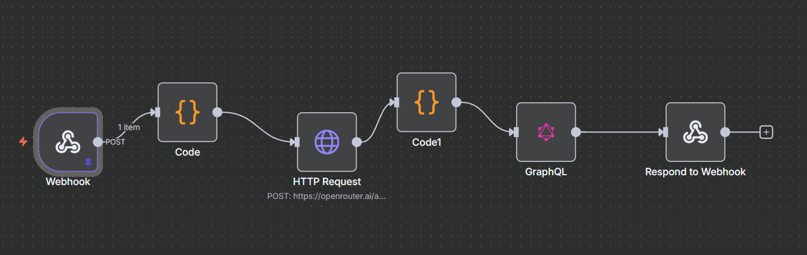

# 🤖 Chatbot App

This is a full-stack chatbot application built with React, Nhost, and a custom N8N workflow for the chatbot logic. The application provides a seamless and real-time chatting experience with user authentication and a persistent chat history.

## 🌐 Live Demo

You can try out the live application here: [https://68a45d3b1010970008e09df0--chat8n.netlify.app/](https://68a45d3b1010970008e09df0--chat8n.netlify.app/)

<!--[Chatbot App Screenshot](https://i.imgur.com/YOUR_SCREENSHOT.png)   Replace with a real screenshot -->

## ✨ Features

*   **User Authentication:** Secure sign-up and sign-in with email and password.
*   **Real-time Chat:** Instant messaging with a chatbot, with messages appearing in real-time.
*   **Chat History:** All conversations are saved and can be revisited.
*   **Create Multiple Chats:** Users can create multiple chat sessions.
*   **Responsive Design:** The application is designed to work on various screen sizes.
*   **N8N Workflow Integration:** The chatbot's logic is powered by a flexible and powerful N8N workflow.

## 🛠️ Tech Stack

*   **Frontend:**
    *   [React](https://reactjs.org/)
    *   [TypeScript](https://www.typescriptlang.org/)
    *   [React Router](https://reactrouter.com/)
    *   [Apollo Client](https://www.apollographql.com/docs/react/) for GraphQL
    *   [Nhost React SDK](https://nhost.io/docs/sdk/react)
*   **Backend:**
    *   [Nhost](https://nhost.io/): Managed backend platform providing:
        *   **Authentication:** User management and authentication.
        *   **GraphQL API:** Instant GraphQL API powered by Hasura.
        *   **PostgreSQL Database:** For storing chat and user data.
*   **Chatbot Logic:**
    *   [N8N](https://n8n.io/): A powerful workflow automation tool used to create the chatbot's logic.

## 🚀 Getting Started

### Prerequisites

*   [Node.js](https://nodejs.org/en/) (v16 or later)
*   [npm](https://www.npmjs.com/)
*   An active [Nhost](https://nhost.io/) account
*   An active [N8N](https://n8n.io/) account (or self-hosted instance)

### Installation

1.  **Clone the repository:**
    ```bash
    git clone https://github.com/your-username/chatbot-app.git
    cd chatbot-app
    ```

2.  **Install frontend dependencies:**
    ```bash
    cd frontend
    npm install
    ```

3.  **Set up Nhost:**
    *   Create a new project on Nhost.
    *   In the Nhost dashboard, go to **Settings > General** and copy the **Subdomain** and **Region**.
    *   Create a `.env` file in the `frontend` directory and add the following:
        ```
        REACT_APP_NHOST_SUBDOMAIN=your-nhost-subdomain
        REACT_APP_NHOST_REGION=your-nhost-region
        ```

4.  **Set up the database:**
    *   In your Nhost project, go to the **Database** section.
    *   Create the following tables:
        *   `chats` (id, title, user_id, created_at, updated_at)
        *   `messages` (id, chat_id, content, role, created_at, user_id)

5.  **Set up the N8N workflow:**
    *   Import the provided N8N workflow into your N8N instance.
    *   Configure the workflow with your chatbot's logic and any necessary API keys.
    *   Expose the workflow as a webhook.

6.  **Create a Hasura Action:**
    *   In your Nhost project, go to the **Hasura** section.
    *   Go to the **Actions** tab and create a new action called `sendMessage`.
    *   Set the webhook URL to your N8N webhook URL.
    *   Define the action's request and response types.

### Running the Application

```bash
cd frontend
npm start
```

The application will be available at `http://localhost:3000`.

## 🤖 N8N Workflow

The chatbot's intelligence is powered by an N8N workflow. This workflow receives the user's message, processes it, and returns a response. This allows for easy customization and integration with various AI models and services.

Here is a high-level overview of the N8N workflow structure:



## 🤝 Contributing

Contributions are welcome! Please feel free to submit a pull request or open an issue.

## 📝 License

This project is licensed under the MIT License. See the [LICENSE](LICENSE) file for details.